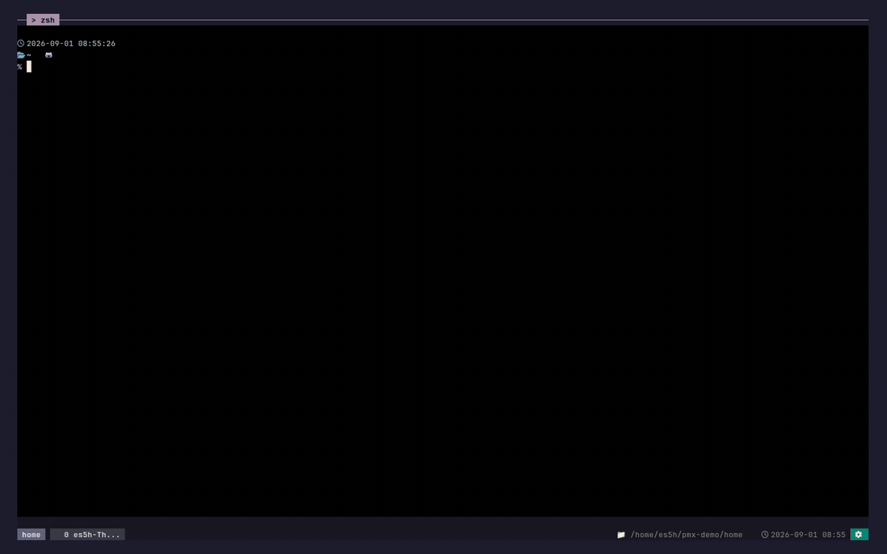
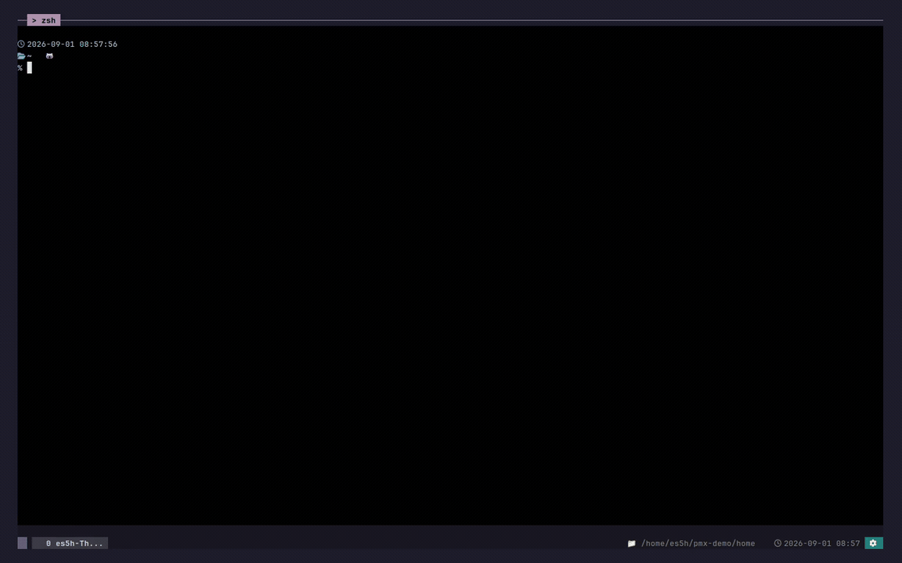
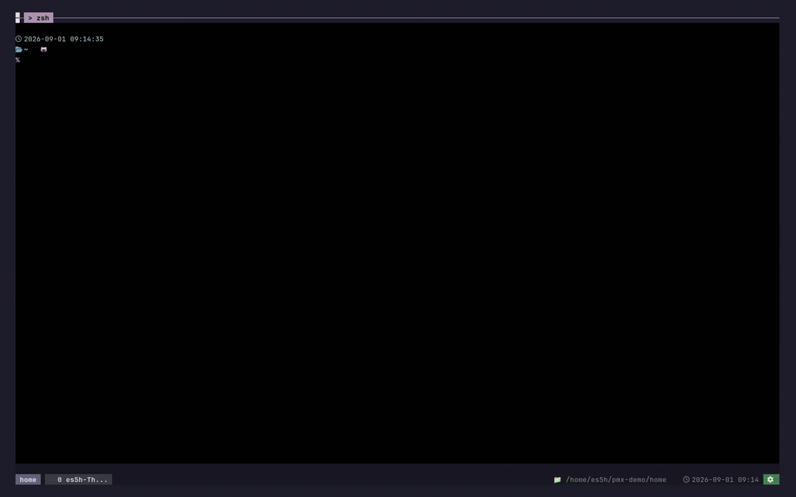

# projmux

<p align="center">
  
</p>

<p align="center">
  <strong>여러 AI 에이전트로 개발하기 위한 tmux 작업 공간.</strong>
  <br>
  <em>Codex, Claude Code, Antigravity를 한 작업 공간에 나란히 띄웁니다.</em>
</p>

<p align="center">
  <a href="https://www.npmjs.com/package/projmux"></a>
  <a href="https://github.com/crevissepartners/projmux/actions/workflows/ci.yml"></a>
  <a href="LICENSE"></a>
  <a href="README.md"></a>
</p>

```sh
npm install -g projmux
projmux shell
```

<p align="center">
  
</p>

## 키

- `Alt-1` 프로젝트
- `Alt-2` 알림
- `Alt-3` 최근 창
- `Alt-4` AI 재개
- `Alt-5` 설정
- `Alt-7` AI 실행 (pane 분할)

`Alt-1`–`Alt-5`는 설정 없이 바로 동작합니다. 키를 바꾸려면
[터미널 키 설정](docs/keybindings.md)을 보세요.

## 하던 대화 이어가기

`Alt-4`를 누르면 Codex, Claude Code, Antigravity 세션이 한 곳에 모여 나옵니다.
하나를 고르면 하던 자리에서, 같은 대화 그대로 열립니다.

## 에이전트가 부를 때

승인 요청이든 작업 완료든, 에이전트가 보내는 알림은 한 곳에 모입니다. `Alt-2`를
누르면 기다리고 있는 pane으로 바로 갑니다.

<p align="center">
  
</p>

## 여러 에이전트를 나란히

창 하나에 shell, Codex, Claude Code를 함께 띄워 둘 수 있습니다. 에이전트가 다른
에이전트를 열 때도 사람이 쓰는 것과 같은 CLI를 씁니다.

```sh
projmux create claude --project mobile-client -- "마이그레이션 계획 초안을 잡아줘."
```

<p align="center">
  
</p>

에이전트별 템플릿과 이름 규칙은
[AI 에이전트 바로가기](docs/ai-agent-shortcuts.md)에 정리해 두었습니다.

## 그 밖에

- [Resource Inspector](docs/resource-attribution.md) — 프로젝트·창·pane별 CPU와
  RSS를 실시간으로 봅니다.
- [Session State](docs/session-restore.md) — 창 배치와 작업 디렉터리를 스냅샷으로
  남깁니다.
- 검색 루트, 키 설정, 업데이트는 설정에서 바꿉니다.

## 요구 사항

[Node.js](https://nodejs.org/)와 npm,
[tmux](https://github.com/tmux/tmux/wiki/Installing) 3.4 이상이 필요합니다.
로컬 환경은 `projmux doctor`로 점검합니다. 읽기만 하고 아무것도 바꾸지 않습니다.
앱이 아예 뜨지 않으면 [문제 해결](docs/troubleshooting.md)을 보세요.

## 문서

[설치 안내](docs/install.md) ·
[설정](docs/configuration.md) ·
[업그레이드](docs/upgrading.md) ·
[CLI 명령어](docs/cli.md) ·
[CLI 사용 가이드](docs/cli-guide.md) ·
[상태 표시줄](docs/statusbar.md) ·
[훅](docs/hooks.md) ·
[사용량 추적](docs/usage-tracking.md) ·
[운영 진단](docs/operational-diagnostics.md) ·
[에이전트 작업 흐름](docs/agent-workflow.md)

## 개발

```sh
make build
make fmt
make fix
make test
```

자세한 내용은 [테스트](docs/testing.md), [구조](docs/architecture.md),
[저장소 구성](docs/repo-layout.md)에 있습니다.

## 라이선스

MIT. [LICENSE](LICENSE)를 보세요.
