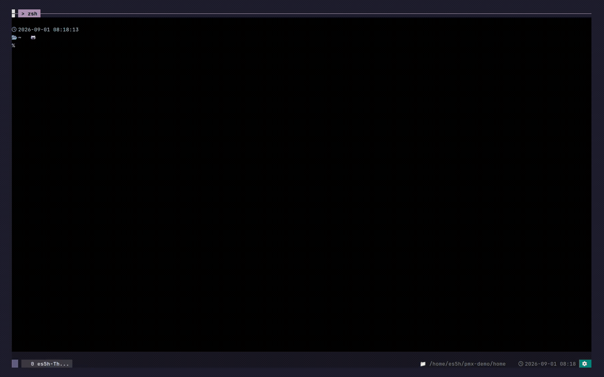

# projmux

<p align="center">
  
</p>

<p align="center">
  <strong>여러 AI 에이전트를 함께 쓰는 tmux 기반 개발 작업 공간.</strong>
  <br>
  <em>Claude Code, Codex, Antigravity pane을 한곳에서 운영하고, 에이전트가 권한을 요청하거나 작업을 마치면 바로 알려 줍니다.</em>
</p>

<p align="center">
  <a href="https://www.npmjs.com/package/projmux"></a>
  <a href="https://github.com/crevissepartners/projmux/actions/workflows/ci.yml"></a>
  <a href="LICENSE"></a>
  <a href="README.md"></a>
</p>

<p align="center">
  
  <br>
  <em>기존 AI 세션을 이어서 열고 다른 프로젝트에서 작업하다가, 에이전트가 승인을 요청하면 그룹형 알림에서 확인하고 해당 작업 pane으로 돌아갑니다.</em>
</p>

## projmux란?

`projmux`는 프로젝트 디렉터리마다 오래 유지되는 tmux 세션을 연결합니다.
프로젝트 전환, 세션 미리보기, AI 분할 창 실행, 상태 표시를 키보드 중심의
작업 공간 하나로 묶습니다.
Claude Code, Codex, Antigravity의 훅 연동을 관리하고, 각 에이전트의 권한
요청과 작업 완료 알림을 한곳에 모읍니다.

터미널 작업 공간을 명령 하나로 열고, 같은 키 조합으로 프로젝트와 tmux
창, pane, 알림, 설정 사이를 빠르게 오가고 싶을 때 사용합니다.

## 요구 사항

- [Node.js](https://nodejs.org/)와 npm: 기본 설치 경로에 필요합니다.
- [tmux](https://github.com/tmux/tmux/wiki/Installing) **3.4 이상**.

설치한 뒤에는 읽기 전용 점검 명령인 `projmux doctor`로 로컬 실행 환경을
확인하세요.

## 설치

```sh
npm install -g projmux
projmux version
```

npm 패키지는 작은 Node.js 실행 연결부와 Linux/macOS x64·arm64용 projmux
실행 파일을 함께 설치합니다. 일반 사용자에게는 npm 설치를 권장합니다.

Go 또는 소스 코드로 직접 설치하는 방법, GitHub Release와 패키징에 관한
내용은 [설치 안내](docs/install.md)를 참고하세요.

## 빠른 시작

독립된 projmux용 tmux 환경을 엽니다.

```sh
projmux shell
```

projmux 안에서는 다음 키를 사용합니다.

- `Alt-1`: 프로젝트 사이드바를 엽니다.
- `Alt-2`: 알림 목록을 엽니다.
- `Alt-3`: 최근 창 목록(`Recent Windows`)을 엽니다.
- `Alt-4`: 이어서 열 AI 세션을 선택합니다.
- `Alt-5`: 설정을 엽니다.
- `Alt-7`: 새 AI 분할 창을 선택합니다.

`Alt-1`부터 `Alt-5`까지는 별도 설정 없이 쓸 수 있는 기본 키입니다. `Alt-7`도
기본으로 제공되며 설정에서 바꿀 수 있습니다. 전체 키 구성은
[터미널 키 설정](docs/keybindings.md)을 참고하세요.

키가 동작하지 않는다면 macOS 배포본의 `projmux shell`에서는 접근성 권한을
한 번 승인하세요. 이후 물리 키 어댑터가 자동으로 동작합니다. 그 밖의
환경에서는 tmux 밖에서 `projmux setup`을 실행한 다음, 지원되는 터미널에
`projmux setup terminal [terminal] --apply`를 적용하세요.

## 일상 사용

- 프로젝트 디렉터리를 고르면 projmux가 해당 tmux 세션을 만들거나 기존
  세션을 다시 사용합니다.
- 자주 쓰는 프로젝트는 `pin`으로 고정해 목록 위쪽에서 쉽게 찾을 수
  있습니다.
- 전환하기 전에 창(window)과 pane, Git 브랜치, AI pane
  상태를 미리 확인할 수 있습니다.
- 기존 Claude, Codex, Antigravity 대화를 이어서 열거나 projmux가 관리하는 새
  AI 분할 창을 만들 수 있습니다.
- 권한 요청과 작업 완료 알림을 에이전트별로 묶어 보고, 확인이 필요한
  pane으로 곧바로 이동할 수 있습니다.
- 읽기 전용 `Resource Inspector`에서 프로젝트, 창, pane별 CPU와 RSS 사용량을
  확인할 수 있습니다. 현재 Linux/tmux 환경을 지원합니다.
- 창과 pane 배치, shell 작업 디렉터리, 지원되는 AI 세션 재개 정보를
  `Session State` 스냅샷으로 저장하고 미리 볼 수 있습니다.
- 환경 변수를 직접 편집하지 않고 `Settings > Project Picker`에서 검색 루트와
  작업 디렉터리를 추가할 수 있습니다.
- `Settings > About > Update` 또는 `projmux update apply`로 업그레이드할 수
  있습니다.

<p align="center">
  
  <br>
  <em>프로젝트를 전환하고 Codex pane을 연 뒤 완료 알림을 확인합니다.</em>
</p>

`PROJMUX_PROJDIR`, 관리 루트, 알림, 사용량 추적에 관한 자세한 내용은
[설정](docs/configuration.md)을 참고하세요. 설치 방식에 따른 업데이트 동작은
[업그레이드 안내](docs/upgrading.md)에 정리되어 있습니다.

## 멀티 에이전트 워크플로

하나의 tmux 창에 shell과 projmux가 관리하는 Claude, Codex, Antigravity pane을
나란히 띄울 수 있습니다. 프로젝트와 pane 사이를 오가며 작업해도 projmux가
에이전트별 권한 요청과 완료 알림을 그룹형 알림함에 모아 줍니다.

<p align="center">
  
  <br>
  <em>shell, Codex, Claude pane을 오가며 서로 다른 작업을 진행하고, 완료 알림은 한곳에서 확인합니다.</em>
</p>

## 에이전트 스킬 자동화

AI 도구에서도 같은 projmux 명령줄 도구(CLI)를 호출해 projmux가 관리하는
pane을 열고 작업 지시를 전달할 수 있습니다.

```sh
projmux ai split --agent codex right -- "Review the retry logic."
```

Claude, Codex를 비롯한 여러 에이전트용 템플릿과 이름 규칙은
[AI 에이전트 바로가기](docs/ai-agent-shortcuts.md)에 정리되어 있습니다.

## 추가 문서

- [설치 안내](docs/install.md)
- [설정](docs/configuration.md)
- [터미널 키 설정](docs/keybindings.md)
- [AI 에이전트 바로가기](docs/ai-agent-shortcuts.md)
- [CLI 명령어](docs/cli.md) — 커맨드 매니페스트에서 생성됨
- [CLI 사용 가이드](docs/cli-guide.md)
- [상태 표시줄](docs/statusbar.md)
- [훅](docs/hooks.md)
- [사용량 추적](docs/usage-tracking.md)
- [Resource Inspector](docs/resource-attribution.md)
- [Session State](docs/session-restore.md)
- [운영 진단](docs/operational-diagnostics.md)
- [에이전트 작업 흐름](docs/agent-workflow.md)

## 개발

```sh
make build
make fmt
make fix
make test
```

기여자를 위한 자세한 내용은 [테스트](docs/testing.md),
[구조](docs/architecture.md), [저장소 구성](docs/repo-layout.md)을 참고하세요.

## 라이선스

MIT. [LICENSE](LICENSE)를 참고하세요.
