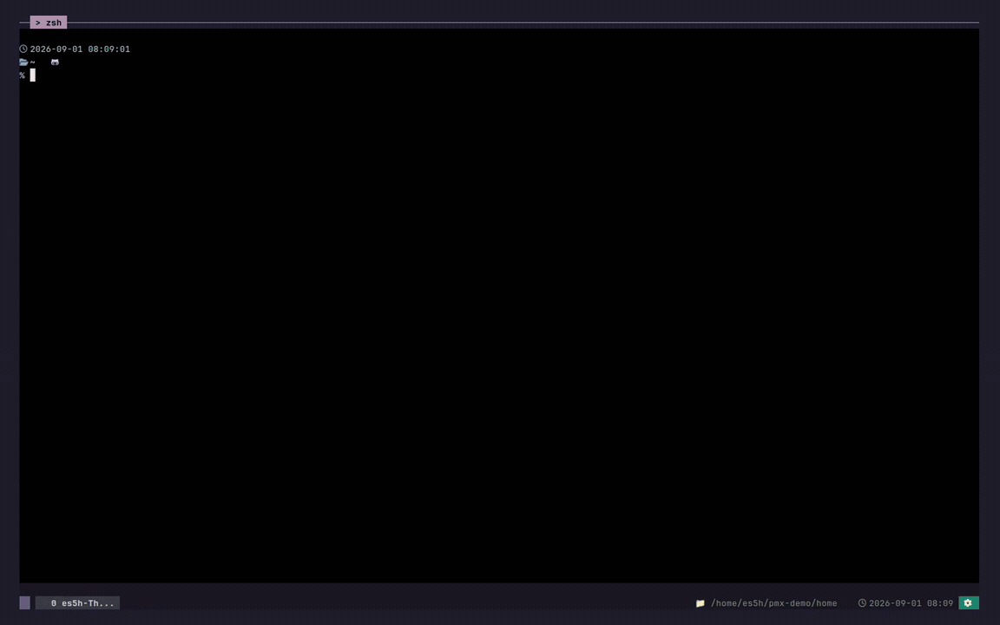

# projmux

<p align="center">
  
</p>

<p align="center">
  <strong>여러 AI 에이전트를 함께 쓰는 tmux 기반 작업 공간.</strong>
  <br>
  <em>Codex, Claude Code, Antigravity를 한 작업 공간에 나란히 띄웁니다.</em>
</p>

<p align="center">
  <a href="https://www.npmjs.com/package/projmux"></a>
  <a href="https://github.com/crevissepartners/projmux/actions/workflows/ci.yml"></a>
  <a href="LICENSE"></a>
  <a href="README.md"></a>
</p>

```sh
npm install -g projmux
projmux shell
```

<p align="center">
  
</p>

## 키

- `Alt-1` 프로젝트
- `Alt-2` 알림
- `Alt-3` 최근 창
- `Alt-4` AI 세션 이어 열기
- `Alt-5` 설정
- `Alt-7` 새 AI 분할 창

`Alt-1`–`Alt-5`는 별도 설정 없이 동작합니다. 키를 바꾸려면
[터미널 키 설정](docs/keybindings.md)을 참고하세요.

## 하던 대화를 이어서

`Alt-4`는 Codex, Claude Code, Antigravity 세션을 보여 줍니다. 고르면 하던
자리에서, 같은 대화로 열립니다.

## 필요할 때 부르게

에이전트의 권한 요청과 작업 완료는 하나의 그룹형 알림함에 모입니다. `Alt-2`를
누르면 기다리고 있는 pane으로 이동합니다.

<p align="center">
  
</p>

## 여러 에이전트를 동시에

하나의 창에 shell과 Codex, Claude Code를 함께 둘 수 있습니다. 에이전트도
사용자와 같은 CLI로 다른 에이전트를 열 수 있습니다.

```sh
projmux create claude --project mobile-client -- "Draft the migration plan."
```

<p align="center">
  
</p>

에이전트별 템플릿과 이름 규칙은
[AI 에이전트 바로가기](docs/ai-agent-shortcuts.md)에 정리되어 있습니다.

## 그 밖에

- 프로젝트·창·pane별 CPU와 RSS를 보는
  [Resource Inspector](docs/resource-attribution.md).
- 창 배치와 작업 디렉터리 스냅샷인
  [Session State](docs/session-restore.md).
- 검색 루트, 키 설정, 업데이트는 설정에서.

## 요구 사항

[Node.js](https://nodejs.org/)와 npm,
[tmux](https://github.com/tmux/tmux/wiki/Installing) 3.4 이상이 필요합니다.
로컬 환경은 읽기 전용 점검 명령 `projmux doctor`로 확인하고, 앱이 열리지
않으면 [문제 해결](docs/troubleshooting.md)을 참고하세요.

## 문서

[설치 안내](docs/install.md) ·
[설정](docs/configuration.md) ·
[업그레이드](docs/upgrading.md) ·
[CLI 명령어](docs/cli.md) ·
[CLI 사용 가이드](docs/cli-guide.md) ·
[상태 표시줄](docs/statusbar.md) ·
[훅](docs/hooks.md) ·
[사용량 추적](docs/usage-tracking.md) ·
[운영 진단](docs/operational-diagnostics.md) ·
[에이전트 작업 흐름](docs/agent-workflow.md)

## 개발

```sh
make build
make fmt
make fix
make test
```

자세한 내용은 [테스트](docs/testing.md), [구조](docs/architecture.md),
[저장소 구성](docs/repo-layout.md)을 참고하세요.

## 라이선스

MIT. [LICENSE](LICENSE)를 참고하세요.
