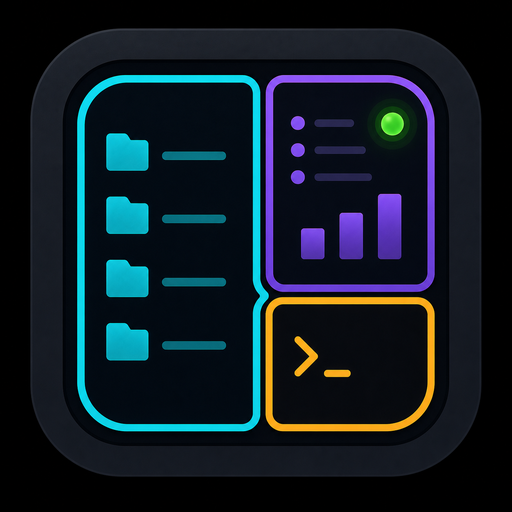
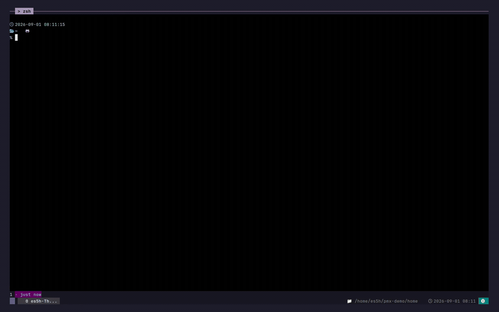
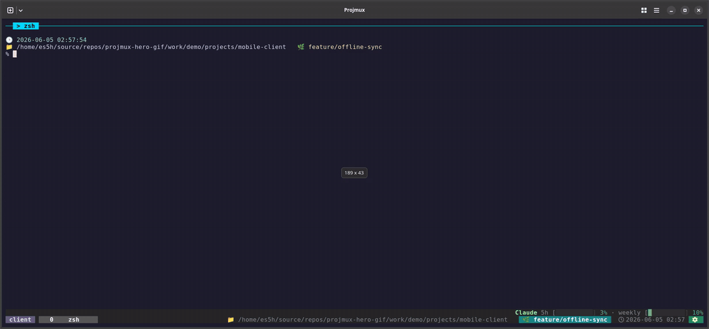

# projmux

<p align="center">
  
</p>

<p align="center">
  <strong>A tmux-native workspace for multi-agent AI development.</strong>
  <br>
  <em>First-class Claude Code and Codex integration with hook-driven attention and agent-aware session resume.</em>
</p>

<p align="center">
  <a href="https://www.npmjs.com/package/projmux"></a>
  <a href="https://github.com/crevissepartners/projmux/actions/workflows/ci.yml"></a>
  <a href="LICENSE"></a>
  <a href="README-ko.md"></a>
</p>

```sh
npm install -g projmux
projmux shell
```

<p align="center">
  
  <br>
  <em>Switch between projects while an AI pane waits for permission, then jump back from the tmux notification list.</em>
</p>

## Why

Six tmux windows. Each one is running Claude Code or Codex on a different
repo. Three are idle. One is waiting on a permission prompt. One crashed an
hour ago and you have no idea which.

projmux ingests Claude Code and Codex hook events directly, shows live
per-pane state in the tmux status bar, and lets one keystroke take you to
the pane that actually needs you. It also remembers each agent's resume id,
so after a reboot every pane comes back as the *same* conversation — not a
fresh one.

## Requirements

- [Node.js](https://nodejs.org/) and npm, for the main install path.
- [tmux](https://github.com/tmux/tmux/wiki/Installing) **3.4 or newer**.

Run `projmux doctor` after installing to check the local runtime.

## Install

The npm package shown above installs a small Node.js shim plus the matching
projmux binary for Linux and macOS on x64 or arm64. npm is the primary
distribution path for normal users.

Verify with `projmux version`. Then `projmux doctor` checks the local runtime
(tmux 3.4+ and hook integration health).

Manual Go, source checkout, GitHub Release, and packaging details live in
[Install](docs/install.md).

## Quick Start

Open the isolated projmux tmux app:

```sh
projmux shell
```

Inside the app:

- `Alt-1` opens the project sidebar.
- `Alt-2` opens the notification list.
- `Alt-3` opens the existing-session picker.
- `Alt-4` opens the AI split picker.
- `Alt-5` opens settings.

Those five launch keys are the guaranteed zero-config defaults. Add more
aliases in Settings > Keybindings or `~/.config/projmux/keymap.toml`. If a key
does not fire, run `projmux setup` outside tmux, then use
`projmux init [terminal] --apply` for supported terminal delivery fallbacks.

## Day-To-Day Use

- Pick a project directory and projmux creates or reuses its tmux session.
- Pin important projects so they stay easy to reach.
- Preview windows, panes, git branch, Kubernetes context, and AI pane state
  before switching.
- Use Settings > Project Picker to add roots and workdirs without editing env
  vars.
- Use Settings > About > Update or `projmux update apply` to upgrade.

For detailed configuration, including `PROJMUX_PROJDIR`, managed roots,
notifications, and usage tracking, see [Configuration](docs/configuration.md).
For update behavior by installer type, see [Upgrading](docs/upgrading.md).

## Agent Skills

projmux shortcuts can also live in your AI tool as user-level skills or slash
commands. A skill is just a thin wrapper around the same CLI contract:

```sh
projmux ai split --agent codex right
projmux ai split --agent claude down
```

After registering a Claude slash command such as `/projmux:codex-right`, ask
Claude to use it with a prompt. Claude runs the projmux command, Codex opens in
a managed pane attached to the current project, and the prompt is delivered
there immediately.
projmux tracks hook events from the opened pane and shows permission or
completion notifications in tmux.

Install templates and naming conventions are in
[AI Agent Shortcuts](docs/ai-agent-shortcuts.md).

<p align="center">
  
  <br>
  <em>Claude invokes a registered projmux skill with a prompt, opens a managed Codex pane, and Codex answers there.</em>
</p>

## More Docs

- [Install](docs/install.md)
- [Configuration](docs/configuration.md)
- [Terminal Keybindings](docs/keybindings.md)
- [AI Agent Shortcuts](docs/ai-agent-shortcuts.md)
- [CLI Reference](docs/cli.md)
- [Statusbar](docs/statusbar.md)
- [Hooks](docs/hooks.md)
- [Usage tracking](docs/usage-tracking.md)
- [Agent Workflow](docs/agent-workflow.md)

## Development

```sh
make build
make fmt
make fix
make test
```

See [Testing](docs/testing.md), [Architecture](docs/architecture.md), and
[Repo Layout](docs/repo-layout.md) for contributor details.

## License

MIT. See [LICENSE](LICENSE).
