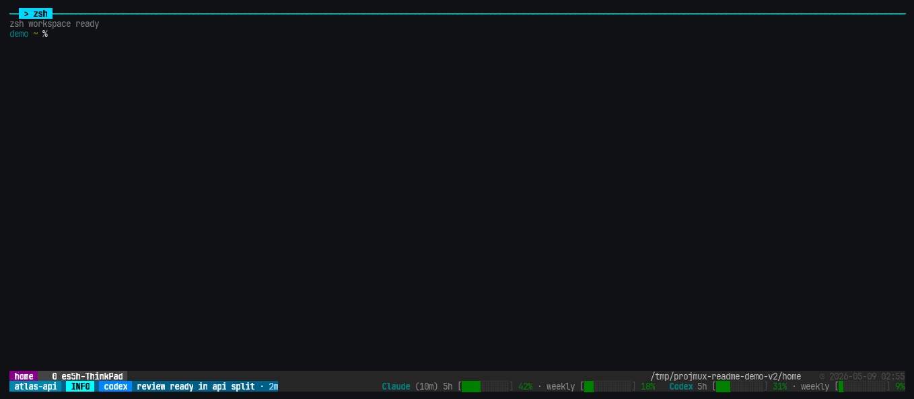

# projmux

Project-aware tmux workspaces with fast switching, previews, status context,
and AI-pane attention built in.

[](https://www.npmjs.com/package/projmux)
[](https://github.com/crevissepartners/projmux/actions/workflows/ci.yml)

[Korean README](README-ko.md)



## What It Is

`projmux` turns project directories into durable tmux sessions. It gives you a
keyboard-first workspace app for switching projects, previewing sessions,
opening AI splits, and keeping useful context visible in tmux.

Use it when you want one command to open your terminal workspace and one set of
keys to move between projects, windows, panes, notifications, and settings.

## Requirements

- [Node.js](https://nodejs.org/) and npm, for the main install path.
- [tmux](https://github.com/tmux/tmux/wiki/Installing) **3.4 or newer**.
- [fzf](https://github.com/junegunn/fzf#installation) **0.65.0 or newer**.

Run `projmux doctor` after installing to check the local runtime. The `fzf`
requirement is the junegunn/fzf CLI binary; `npm i fzf` is a different
JavaScript library.

## Install

```sh
npm install -g projmux
projmux version
```

The npm package installs a small Node.js shim plus the matching projmux binary
for Linux and macOS on x64 or arm64. npm is the primary distribution path for
normal users.

Manual Go, source checkout, GitHub Release, and packaging details live in
[Install](docs/install.md).

## Quick Start

Open the isolated projmux tmux app:

```sh
projmux shell
```

Inside the app:

- `Alt-1` opens the project sidebar.
- `Alt-2` opens the notification list.
- `Alt-3` opens the existing-session picker.
- `Alt-4` opens the AI split picker.
- `Alt-5` opens settings.
- `Alt-6` opens the project switcher popup.

See [Terminal Keybindings](docs/keybindings.md) for the full key map. If a key
does not fire, run `projmux setup` outside tmux, then use
`projmux init [terminal] --apply` for supported terminal fallbacks.

## Day-To-Day Use

- Pick a project directory and projmux creates or reuses its tmux session.
- Pin important projects so they stay easy to reach.
- Preview windows, panes, git branch, Kubernetes context, and AI pane state
  before switching.
- Use Settings > Project Picker to add roots and workdirs without editing env
  vars.
- Use Settings > About > Update or `projmux update apply` to upgrade.

For detailed configuration, including `PROJMUX_PROJDIR`, managed roots,
notifications, and usage tracking, see [Configuration](docs/configuration.md).
For update behavior by installer type, see [Upgrading](docs/upgrading.md).

## More Docs

- [Install](docs/install.md)
- [Configuration](docs/configuration.md)
- [Terminal Keybindings](docs/keybindings.md)
- [CLI Reference](docs/cli.md)
- [Statusbar](docs/statusbar.md)
- [Hooks](docs/hooks.md)
- [Usage tracking](docs/usage-tracking.md)
- [Agent Workflow](docs/agent-workflow.md)

## Development

```sh
make build
make fmt
make fix
make test
```

See [Testing](docs/testing.md), [Architecture](docs/architecture.md), and
[Repo Layout](docs/repo-layout.md) for contributor details.

## License

MIT. See [LICENSE](LICENSE).
